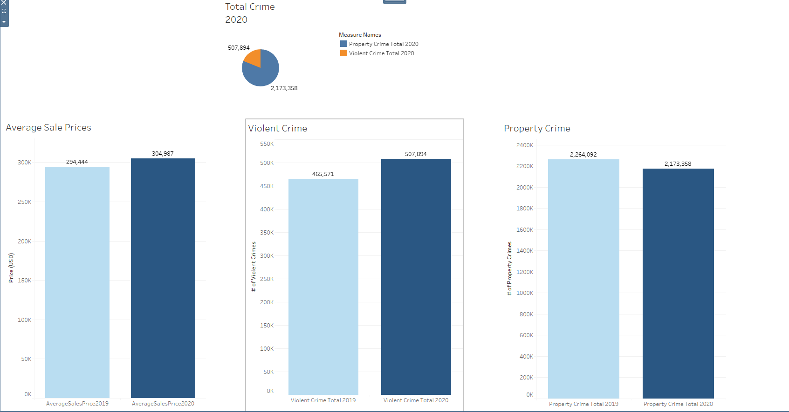

# Final Project

## Content

The topic we have selected was to examine crime rate data and housing price data by county and create a machine learning tool to see if we could create an environment that would predict housing price based on the level of crime that occurs and personal income in a given county.

The topic was selected out of a mutual interest in finances, crime/crime rate data, and how it may affect the housing market and where people choose to live.

## Questions and Application

What we are looking for in are data set is a correlation between crime and housing princes in big cities across the United States. To complement this data, we will be using personal income data to display how income is associated with housing prices and crime in these cities.

Using the data we will try to display how housing prices have changed within a given year as a result of the crime in these cities, also taking into account the change in median income.

Currently based on the crime dataset we have what is listed are types of crimes, population, city-state, and year.
The other dataset will have a personal income dataset that will be used in conjunction with the crime dataset.

If we were running a real-estate site we could use this data to determine which state and town are good for future investment.
 from an investment standpoint, I would use this data to purchase homes at a time when housing prices are down because of crime. Usually, this is when large investments are made in real estate. 

## Communication Tools Used

* Files were shared using a GitHub repository whith separate branches for each member being used. Commits and pushes to the main branch are done upon request.
* Day-to-day text communication was done using the Slack communication platform.
* Group meetings are held over Zoom meetings on webcam to share ideas and to work more intricately on the project.

## Database

* [Zillow House Price Data](https://www.kaggle.com/paultimothymooney/zillow-house-price-data): [Sale_Prices_City.csv](https://github.com/HarryWightJr/final_project/blob/main/Resources/Sale_Prices_City.csv)
  * The dataset contains the median price at which all home types across various cities were sold on Zillow website each month from 2008 to 2020. 

* [Table 8 - Offenses Known to Law Enforcement](https://ucr.fbi.gov/crime-in-the-u.s): [Crime_2019.csv](https://github.com/HarryWightJr/final_project/blob/main/Resources/Crime_2019.csv) [Crime_2020.csv](https://github.com/HarryWightJr/final_project/blob/main/Resources/Crime_2020.csv) 
  * The Crime in the United States report contains a compilation of the volume and rate of violent and property crime offenses for the nation and by state using Summary Reporting System data and summarized data from the National Incident-Based Reporting System (NIBRS) 

* [United States Cities Database](https://simplemaps.com/data/us-cities): [uscities.csv](https://github.com/HarryWightJr/final_project/blob/main/Resources/uscities.csv)
  * The dataset contains the mapping between US cities and counties.

* [Personal Income by County](https://www.bea.gov/news/2021/personal-income-county-and-metropolitan-area-2020): [Income.csv](https://github.com/HarryWightJr/final_project/blob/main/Resources/Income.csv) 
  * The dataset contains the per capita personal income for each US county from 2019 to 2020.

We will only use the data from all these datasets from the period of 2019 to 2020. Since we are not able to retrive the median household income for each city, we will alter the original csv file [Sale_Prices_City.csv](https://github.com/HarryWightJr/final_project/blob/main/Resources/Sale_Prices_City.csv) by mapping each city to its county using the United States Cities Database [uscities.csv](https://github.com/HarryWightJr/final_project/blob/main/Resources/uscities.csv) in Excel. Also in order to reduce the file sizes of the datasets, some unnecessary columns are droppped using Excel.

## Data Visualization

Here we can see the year over year for Average Sales Price of Homes, total Violent Crime, and total Property Crime for 2019 and 2020. 

## Machine Learning Model
Click here to view the model using local database: [Linear Regression Model](https://github.com/HarryWightJr/final_project/blob/main/linear_regression_local.ipynb)
 
We are building a machine learning model using multiple linear regression algorithm based the correlation between housing prices and crime, personal income, . The model will be designed to output a predicted house sale price by inputting a US county.

